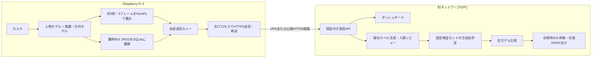

# Sustainable Vision Learning 3.0

## 端末ごとのコード

`raspi/run.py` は収集・推論・転送専用、`pc/run.py` は受信・画面・学習専用です。依存関係とREADMEもそれぞれのフォルダーに分離しました。

```powershell
python tools/build_device_bundles.py --output runs/platform/device-bundles-v3
```

`svl-raspi.zip` と `svl-pc.zip`、展開済みフォルダーを生成します。既存の出力先は上書きしません。Pi用にPCのAPI・学習コードは入りません。PC用の共通runtimeにはロック・保存先処理だけを含めます。共通コードは元の `app/edge` から生成するため、修正を二重管理する必要はありません。

配布ZIPには画像、モデル、ユーザーの設定、認証トークンを入れません。各ZIP内のREADMEに沿って `python run.py init` から初期設定してください。既存の作業環境で `python pc/run.py dashboard` を使う場合は、従来の `config/server.yaml` をそのまま利用します。

アクセストークンはこのシステム内の共有認証キーです。PCとPiに同じ値を設定します。ブラウザーの接続欄にも同じ値を入力します。OpenAIのAPIキーではありません。環境変数未設定でPCダッシュボードを起動した場合は `config/runtime/server/access-token.txt` の内容が現在の値です。

## 構成

旧版を残した追加版です。`auto_capture.py` は変更せず、新版は `auto_capture_v3.py` または `python -m app.edge capture` を使います。



Piが外向き通信を開始します。PCからPiへの接続やポート開放は不要です。PCは到達可能な受信経路を用意する必要があります。同じプライベートIPを別ネットワークから指定するだけでは接続できません。

## 機能一覧

| 機能 | 実行場所 | 単独コマンド |
|---|---|---|
| 本番推論・集計・難例キャプチャー | Pi | `python -m app.edge production --config config/edge.yaml` |
| 推論なしキャプチャー | Pi | `python auto_capture_v3.py --config config/edge.yaml` |
| 定期HTTP転送 | Pi | `python -m app.edge transfer --config config/edge.yaml` |
| 1回だけ転送 | Pi | 上記に `--once` |
| PCダッシュボード・受信API | PC | `python -m app.edge dashboard --config config/server.yaml --port 8001` |
| Piローカルダッシュボード（任意） | Pi | `python -m app.edge dashboard --config config/edge.yaml` |
| 受信画像の疑似ラベル生成 | PC | `python -m app.edge label --config config/server.yaml` |
| 学習・評価・任意昇格 | PC | `python train_v3.py --config config/server.yaml` |

本番推論プロセスはキャプチャーも行います。カメラを使う `production` と `capture` は同時起動しません。`transfer` は別プロセスなので、HTTP待ちで推論が停止しません。学習はPC限定です。ダッシュボードを起動しなくても各コマンドは使用できます。

## 初期設定

PCで完全な実行環境を作成します。UIだけ確認する場合は `requirements-dev.txt` を利用できますが、学習・モデル推論はできません。

```powershell
python -m venv .venv
.\.venv\Scripts\python.exe -m pip install -r requirements.txt
.\.venv\Scripts\python.exe -m app.edge init --role server --config config/server.yaml
$env:SVL_EDGE_TOKEN = '自分で生成した長いランダムな共有トークン'
.\.venv\Scripts\python.exe -m app.edge dashboard --config config/server.yaml --port 8001
```

`http://127.0.0.1:8001/v3` を開き、トークンで接続します。受信設定ページでPiと同じIDのプロジェクトを作成します。新しい認証はv3専用です。旧版のブラウザー内ユーザー名・パスワードとは別です。

トークン未設定でダッシュボードを起動した場合は、ローカル確認用トークンを `config/runtime/server/access-token.txt` に生成します。送信コマンドはトークンを自動生成しません。PCとPiで同じ値を環境変数に設定してください。トークン値はYAMLに記録しません。

Piでは64bit OSと対応するPython環境を使います。Ultralytics/PyTorchのARM対応ホイールや推論速度は実機で確認してください。

```bash
python3 -m venv .venv
.venv/bin/python -m pip install -r requirements-edge.txt
.venv/bin/python -m app.edge init --role edge --config config/edge.yaml
export SVL_EDGE_TOKEN='PCと同じ共有トークン'
.venv/bin/python -m app.edge dashboard --config config/edge.yaml
```

Piの本番推論画面で人物モデル、階数モデル、カメラ、ROIを設定し、転送画面でPCのURLを設定します。ファイル選択はそのダッシュボードが動く端末のファイルを選びます。PC側パスをPiへそのまま指定しないでください。

## 別ネットワークの接続

1. VPNを利用してPiからPCのVPNアドレスへ接続するか、PCに到達するHTTPSホスト名を準備します。
2. HTTPS公開する場合は、リバースプロキシで `/v3/ingest` だけを公開します。`deploy/Caddyfile.example` は設定例です。ホスト名、DNS、ルーター、ファイアウォール、証明書は環境に合わせて設定してください。
3. PC側サーバーはローカルプロキシ利用なら `127.0.0.1:8001` のままで構いません。VPNから直接接続する場合は `--host` にPCのVPNアドレス等を指定します。
4. Piの `server_url` は `https://receiver.example.com` のようなベースURLです。末尾に `/v3/ingest` は付けません。
5. 自己署名証明書の検証無効化は実装していません。信頼できる証明書・信頼ストアを設定してください。

ダッシュボードの設定変更・プロセス操作・ファイル一覧APIはローカルまたは管理用VPN内で使用します。受信API以外を公開する必要はありません。ネットワーク機器や公開サービスは本実装では変更していません。

## 集計と1階への予測時間

- 標準は3秒窓、0.6秒間隔を目標に5フレームです。同一取得フレームは二重に数えません。
- 推論が遅い場合は実際に処理できた数だけ送信します。`actual_frames`、窓の開始・終了時刻で不足・遅延を確認できます。Pi 4で5フレーム/3秒を保証するものではありません。
- 人数は画面内で検出された人数の `numpy.mean`。入退室の累計や追跡IDによるユニーク人数ではありません。
- 階数は有効な検出の平均 `floor_mean` と最頻値 `floor` を併記します。平均値を実際の階数として丸めて採用しません。同票は不明です。
- UP/DOWNは有効な方向検出に占める割合と多数決です。欠測は除外し、有効数を併記します。上下を単純に数値平均して「停止」と判定しません。
- 各フレームで経路の所要時間をNumPyで計算し、その平均を送ります。方向不明で現在階が1階以外なら推定不可です。
- 下降: `(現在階 - 1) × 1階分移動秒数 + 中間階の停止秒数合計`。
- 上昇: 最高階へ移動 → 折り返し → 1階まで下降。往復中間階の停止秒数を加算します。最高階の停止は `turnaround_seconds` に含めます。出発階の残り停止時間、1階到着後の停止は含みません。
- 停止秒数は `stop_seconds` が既定値、`floor_stop_seconds` のJSONで階ごとに上書きできます。すべての中間階に停止するシナリオ予測であり、実際の呼出し・運行予定を把握した到着保証ではありません。

例: 最高5階、現在3階、1階分3秒、各階5秒、折り返し10秒では、下降11秒・上昇48秒です。

モデルの `names` と `floor_map` / `people_classes` / `up_classes` / `down_classes` を一致させます。数字単体を別々に検出するモデルから「11」を組み立てるOCR処理は未実装です。複数エレベーターの表示を混ぜないよう、1つの表示パネルへROIを設定してください。

## 画像蓄積・通信量

- 本番推論では、階数・方向の欠測または設定confidence未満の画像を候補として保存します。推論なしキャプチャーは時間と重複条件で保存します。
- ROI切り出し、長辺縮小、JPEG圧縮、32×32輝度差で重複除外を行います。メタデータのbboxは元ROI座標であり、縮小JPEGの教師ラベルとして流用しません。
- デフォルト画像保存間隔30秒、画像転送間隔300秒、集計値送信間隔3秒です。転送開始時はキューをすぐ確認します。
- UUID単位の永続キューです。PCが同じIDを受信しても重複登録せず、応答が失われた場合も再送できます。成功応答のID確認後のみ送信済みにします。
- 再試行は指数バックオフ、最大1時間です。通信失敗も推定通信量に加算します。
- 既定予算は画像5MB/日、全転送12MB/日・400MB/月。UTCで日付変更します。JSON/Base64サイズにリクエスト当たり2048bytesを足した概算で、通信事業者の課金量と一致する保証はありません。TLS、再送、他アプリ分は事業者側でも確認してください。
- 毎3秒で30日送ると864,000リクエストです。1KB/回でも約864MBになるため、500MB/月では全回送信できません。送信間隔を伸ばすか、Wi-Fi/VPN接続時にまとめて送る運用を選んでください。現在の予算設定では上限到達後は送信待ちになります。
- 蓄積上限は既定256MB（イベント本文・画像の合計）。SQLite管理領域やログは別です。満杯時は収集をエラー停止し、未送信画像を勝手に削除しません。送信プロセスは送信済み・取込済みイベントの7日超分を削除します。PCは定期的なDBのバックアップ・容量管理が必要です。

## PC側のレビューと学習

受信画像をそのまま教師ラベル付き学習データにはしません。「受信画像の疑似ラベルを生成」で、既存プロジェクトのモデルを使って推論し、既存のサンプル・レビュー管理へ取り込みます。v3では必ず人間レビュー条件を有効にします。無検出は既存ポリシーに従って却下になります。

レビューとモデル選択は既存プラットフォームのページを使えます。v3学習はラベル付き外部 `dataset.yaml` を明示指定します。承認後のデータをデータセットへまとめ、固定した検証セットを保って指定してください。手動の枠編集は外部アノテーションツールを使用します。

学習は現在選択中のモデルから追加学習します。train/val両方が非空、各画像のラベルファイルが存在、同じ内容の画像がtrain/valをまたがないことを確認します。学習前後でデータとラベルのSHA-256を比較し、変更があれば昇格しません。空のラベルファイルは負例として許容します。

旧モデルと候補を同じ検証セットで評価し、有限なmAP50が取得できた場合だけ比較します。既存の最低mAP50・旧モデル比較条件を使います。既定では評価までで停止し、自動昇格はOFFです。クラス別の悪化判定ゲートは今回未追加です。

学習Runはプロジェクトの `runs/v3/<job_id>/` に分離します。旧モデルはレジストリーに残し、既存UI/APIからrollback可能です。ONNX出力は評価合格時の任意操作です。Piへのモデル自動配布・自動上書きは今回実装していません。Wi-Fi等での配布とパイロット確認を推奨します。

## 保存場所

```text
app/edge/                     v3コード（Pi/PC共通）
config/edge.yaml              Pi設定（ローカル生成、Git対象外）
config/server.yaml            PC設定（ローカル生成、Git対象外）
config/runtime/edge/          PiキューDB・画像プレビュー・サービスログ
config/runtime/server/        PC受信DB・サービスログ
projects/<project>/data/      PCレビュー用画像・ラベル
projects/<project>/models/    PCモデルレジストリー
projects/<project>/runs/v3/   学習成果物・評価レポート
```

画像と未送信メタデータはDB内に一体保存します。設定ファイルを別の場所に置くと、その親の `runtime/<設定ファイル名>/` を使います。変更はサービス停止後に保存します。Pi/PCで設定ファイルやDBを直接共有する必要はありません。

## API

v3 APIは `Authorization: Bearer <token>` が必要です。HTMLの表示のみ認証不要です。

| Method | URL | 内容 |
|---|---|---|
| GET | `/v3` | ダッシュボード |
| GET/PUT | `/v3/config` | 設定取得・保存 |
| GET | `/v3/status` | 集計値、受信履歴、キュー数、状態、通信概算 |
| POST | `/v3/ingest` | Piからの集計値またはJPEG受信。最大2MB |
| POST | `/v3/services/{name}/start` | ローカル機能を別プロセス起動 |
| POST | `/v3/services/{name}/stop` | ローカル機能に停止要求 |
| GET | `/v3/files?path=...` | その端末のパス候補 |
| GET | `/v3/preview` | 最新キャプチャー/受信JPEG |
| GET/POST | `/v3/projects` | PCの既存プロジェクト取得・作成 |

集計値: `event_id`, `kind=telemetry`, `project_id`, `device_id`, `window_start`, `window_end`, `expected_frames`, `actual_frames`, `people_mean`, `floor_mean`, `floor`, `direction`, `up_ratio`, `down_ratio`, `return_seconds_mean`, 各有効数、予測条件。

画像: `kind=image` と共通識別子、時刻、ROI、予測メタデータ、`jpeg_base64`。成功応答は `event_id` と `status=stored`。異なる内容でのID再利用は400、トークン不一致401、未作成プロジェクト404、サイズ超過413、保存容量超過507です。

## 常駐・Docker

Piのsystemd例は `deploy/edge-production.service` / `edge-transfer.service`。`svl` ユーザー、`/opt/svl` の配置、`/var/lib/svl/edge.yaml`、`/etc/svl/edge.env` と読書き権限を準備してから有効化してください。ユニットは異常終了時再起動です。ブラウザー起動は不要です。

PC用Docker例:

```bash
docker build -f Dockerfile.v3 -t svl-v3 .
docker run --rm -v svl-state:/state svl-v3 python -m app.edge init --role server --config /state/server.yaml
docker run --rm -p 127.0.0.1:8001:8001 -e SVL_EDGE_TOKEN -v svl-state:/state -v svl-projects:/app/projects svl-v3
```

GPU利用や外部データセットのマウントはホストに合わせて追加します。Dockerイメージのビルド・Piのsystemd導入は実行していません。

## テストと残課題

`pip install -r requirements-dev.txt` 後、`python -m pytest -q`。集計・欠測・往復時間、5フレーム窓、ROI重複、永続化、再送、認証、重複受信、保存予算、データリークを検証します。

`node tests/edge-browser.cjs` はPCサーバー起動後のブラウザーテストです。Playwrightが必要で、環境に応じて `PLAYWRIGHT_MODULE`, `BROWSER_CHANNEL`, `UI_URL`, `TOKEN_FILE` を設定します。

実機未確認: Pi 4のカメラ、人物・階数モデルの精度/速度、ARM依存関係、別ネットワーク経由のHTTPS、GPU学習。実モデル・送信URLが未指定のため、これらの本番動作完了を意味しません。

Ultralyticsの呼び出しは公式の [推論API](https://docs.ultralytics.com/modes/predict/) と [学習API](https://docs.ultralytics.com/modes/train/) に合わせています。添付のエッジ運用資料を設計背景に使い、今回は結果送信をユーザー指定のHTTP方式で実装しました。MQTT、強化学習、C++化、Piへのモデル自動配布は追加していません。
